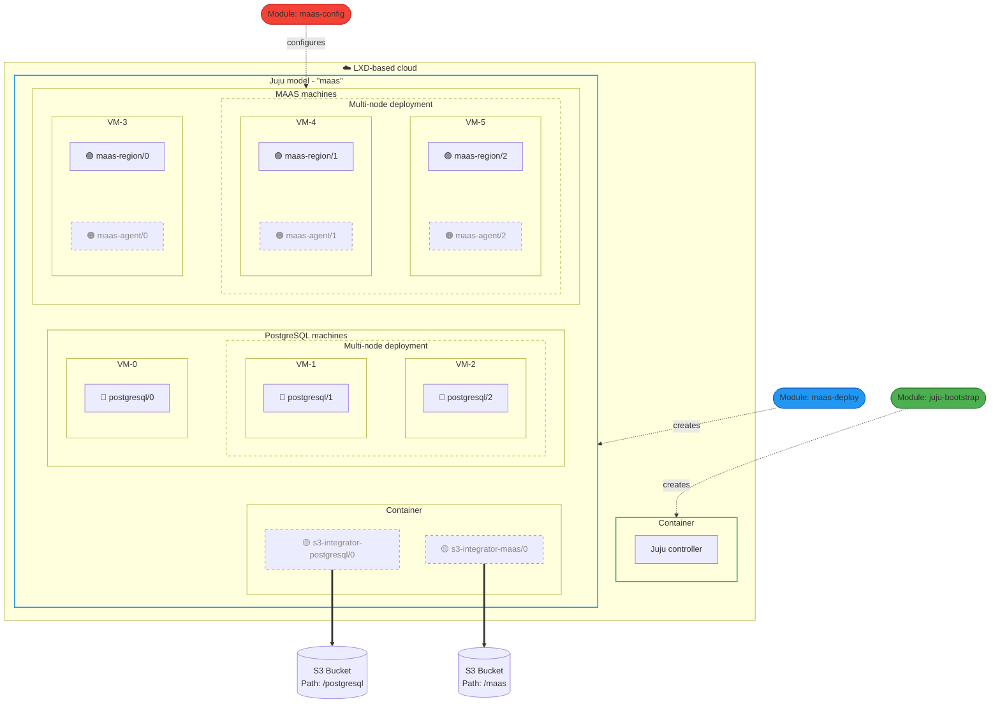

# Terraform driven Charmed MAAS deployment

This repository exists as a deployment and configuration solution for a [Charmed](https://juju.is/docs) Multi-Node [MAAS](https://canonical.com/maas/docs) cluster with various topologies using up-to three [Terraform](https://developer.hashicorp.com/terraform/docs) Modules.

> [!NOTE]
> This repository has been tested on LXD cloud, and the documentation wording reflects that. Any machine cloud should be a valid deployment target, though manual cloud is unsupported.

> [!NOTE]
> The contents of this repository is in an early release phase. We recommend testing in a non-production environment first to verify they meet your specific requirements before deploying in production.

## Contents

- [Terraform driven Charmed MAAS deployment](#terraform-driven-charmed-maas-deployment)
  - [Contents](#contents)
  - [Architecture](#architecture)
      - [MAAS Regions](#maas-regions)
      - [MAAS Agents](#maas-agents)
      - [PostgreSQL](#postgresql)
      - [Juju Controller](#juju-controller)
      - [LXD Cloud](#lxd-cloud)
  - [Deployment Instructions](#deployment-instructions)
  - [Appendix - Backup and Restore](#appendix---backup-and-restore)
  - [Appendix - Prerequisites](#appendix---prerequisites)

The full MAAS cluster deployment consists of: one optional bootstrapping, one of two Deployment, and a recommended (but optional), Terraform modules that should be run in the following order:

- [Juju Bootstrap](./modules/juju-bootstrap) - Bootstraps Juju on a provided LXD server or cluster; Optional if you already have an external Juju controller.
- [MAAS Deploy](./modules/maas-deploy) - Deploys charmed MAAS at a Juju model of the provided Juju controller (`juju-bootstrap` or external)
- [MAAS Config](./modules/maas-config) - Configures the charmed MAAS deployed by `maas-deploy`; Optional but highly recommended. You *can* configure your MAAS independently, but automation is the recommended pathway.

## Architecture

This diagram describes the system architecture of infrastructure deployed by the three Terraform modules in this repository, on a LXD-based cloud, for both single and multi-node deployments. Distinct Juju applications are represented with colored markers (🟡🔵🟠🟣) on each unit, and the parts of the architecture that are optional depending on your configuration are represented with dashed outlines.

A charmed MAAS deployment consists of the following atomic components:

#### MAAS Regions
Charmed deployment of the MAAS Snap, [learn more here](https://charmhub.io/maas-region)

#### MAAS Agents
Charmed deployment of the MAAS Snap as a rack controller
For a MAAS Region+Rack deployment, the Agent charm is deployed with the Region charm on the same node, and the MAAS snap is configured in Region+Rack mode.
> [!NOTE]
> MAAS Agent charm will be removed from deployment and set to end-of-life in the near future. Region+Rack will still be provided as an option in the Region charm however.

#### PostgreSQL
Charmed deployment that connects to MAAS Regions to provide the MAAS Database, [learn more here](https://canonical-charmed-postgresql.readthedocs-hosted.com/16/)

#### Juju Controller
Orchestrates the lifecycle of the deployed charmed applications, [learn more here](https://documentation.ubuntu.com/juju/3.6/reference/controller/)

#### LXD Cloud
Provides the underlying virtual-machine infrastructure that Juju runs on.
While the development of this repository occured on LXD clouds, Juju does support others too: [learn more here](https://documentation.ubuntu.com/juju/3.6/reference/cloud/)

LXD Containers and Virtual machines are deployed as Juju machines, which Juju uses to deploy charms in.

## Deployment Instructions

Before beginning the deployment process, please make sure that [prerequisites](#appendix---prerequisites) are met.

These instructions will take you from a bare system to a running MAAS cluster with either [One](./docs/how_to_deploy_single_node.md) or [Three](./docs/how_to_deploy_multi_node.md) MAAS Regions, one node PostgresSQL or three-node PostgreSQL, and optionally deploying a Juju controller if you are not [supplying one externally](./docs/how_to_deploy_to_a_bootstrapped_controller.md).

1. [Connect to a Juju controller](./docs/how_to_deploy_to_a_bootstrapped_controller.md) or [Bootstrap a Juju controller](./docs/how_to_bootstrap_juju.md)
2. Deploy a [multi-node](./docs/how_to_deploy_multi_node.md) or [single-node](./docs/how_to_deploy_single_node.md) MAAS cluster
3. [Configure](./docs/how_to_configure_maas.md) your running MAAS instance

## Appendix - Backup and Restore

There exist two suplementary documents for instructions on [How to Backup](./docs/how_to_backup.md) and [How to Restore](./docs/how_to_restore.md) your MAAS Cluster.

It is recommended to take a backup of your cluster after initial setup.

## Appendix - Prerequisites

To run the Terraform modules, the following software must be installed in the local system:

- Juju 3.6 LTS `snap install juju --channel 3.6/stable`
- OpenTofu/Terraform

The Terraform modules also expect that network connectivity is established from local system to:

- LXD cluster/server where Juju will be bootstrapped and MAAS will be deployed
- Bootstrapped Juju controller
- Deployed MAAS

It is recommended to create a jumphost/bastion LXD container on the LXD cluster/server, install the pre-requisites, git clone this repository, and apply the Terraform modules from there.
Juju bootstrap expects connectivity with the LXD API, and we presume connectivity with private addresses of the Juju machines for troubleshooting.
The `maas-config` module also requires access to MAAS via the same private machine addresses, until a time as to which a load balancer is introduced to these steps.
