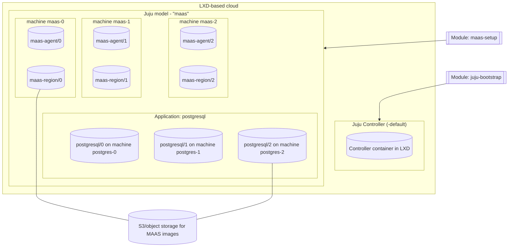

```mermaid
flowchart TB
  %% High-level modules
  TF1[[Module: juju-bootstrap]]
  TF2[[Module: maas-setup]]

  %% LXD cloud
  subgraph LXD["LXD-based cloud"]
    %% Juju controller
    subgraph CTRL["Juju Controller (<cloud_name>-default)"]
      JC[(Controller container in LXD)]
    end

    %% MAAS model
    subgraph MODEL["Juju model - &quotmaas&quot"]

      %% PostgreSQL application (force horizontal)
      subgraph PG["Application: postgresql"]
        direction LR
        PG0[(postgresql/0 on machine postgres-0)]
        PG1[(postgresql/1 on machine postgres-1)]
        PG2[(postgresql/2 on machine postgres-2)]

      end

      %% Machines that host MAAS Region + Agent (colocated)
      subgraph M0["machine maas-0"]
        R0[(maas-region/0)]
        A0[(maas-agent/0)]
      end
      subgraph M1["machine maas-1"]
        R1[(maas-region/1)]
        A1[(maas-agent/1)]
      end
      subgraph M2["machine maas-2"]
        R2[(maas-region/2)]
        A2[(maas-agent/2)]
      end
    end
  end

  %% Integrations (invisible edges for layout)
  R0 ~~~ PG
  R1 ~~~ PG
  R2 ~~~ PG
  A0 ~~~ R0
  A1 ~~~ R1
  A2 ~~~ R2

  %% External/object storage for images (S3/MinIO/RGW)
  S3[(S3/object storage for MAAS images)]
  R0 --- S3
  PG2 --- S3


  %% Module responsibilities
  TF1 --> CTRL
  TF2 --> MODEL
```
