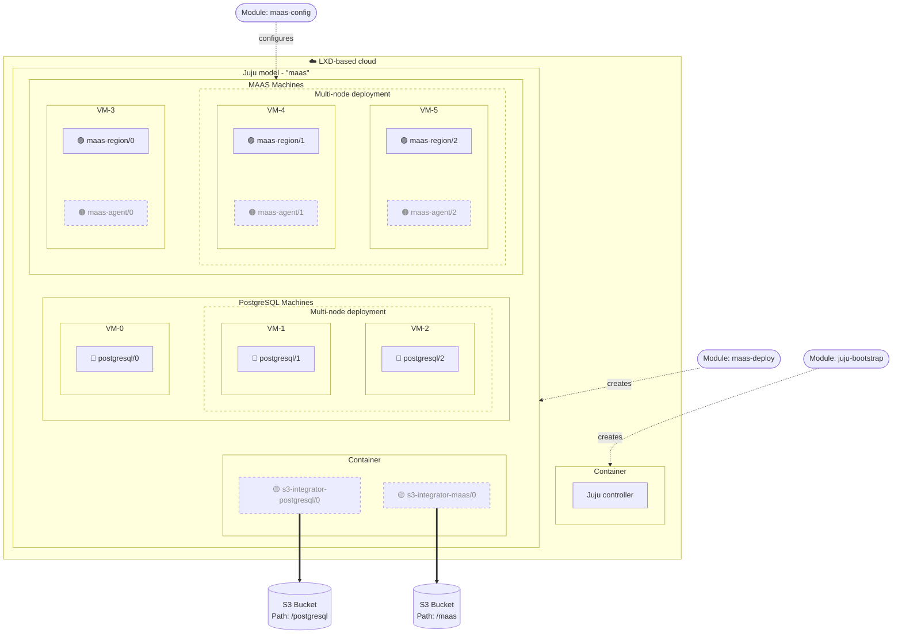

```mermaid
flowchart TB
  %% Styling for different concepts (not much right now!)
  %% classDef tfModule
  %% classDef cloud
  %% classDef model
  %% classDef machine
  classDef unitOptional color:#888888,stroke-dasharray: 5 5
  classDef multiNodeGroup stroke-dasharray: 5 5
  %% LXD Cloud
  subgraph CLOUD["☁️ LXD-based cloud"]
    direction TB

    %% Juju Controller
    subgraph CTRL["Container"]
      JC["Juju controller"]
    end

    %% MAAS Model
    subgraph MODEL["Juju model - &quotmaas&quot"]

      %% MAAS colocated machines
      subgraph MAAS_MACHINES["MAAS Machines"]
         subgraph MAAS_M0["VM-3"]

          R0["🟣 maas-region/0"]
          A0["🟠 maas-agent/0"]
        end
         subgraph MAAS_MULTINODE["Multi-node deployment"]
          subgraph MAAS_M1["VM-4"]

            R1["🟣 maas-region/1"]
            A1["🟠 maas-agent/1"]
          end
          subgraph MAAS_M2["VM-5"]

            R2["🟣 maas-region/2"]
            A2["🟠 maas-agent/2"]
          end
         end
        %% Force horizontal layout
        MAAS_M0 ~~~ MAAS_M1 ~~~ MAAS_M2
      end

      %% PostgreSQL dedicated machines
      subgraph PG_MACHINES["PostgreSQL Machines"]
         subgraph PG_M0["VM-0"]
           PG0["🔵 postgresql/0"]
        end
        subgraph PG_MULTINODE["Multi-node deployment"]
          subgraph PG_M1["VM-1"]
            PG1["🔵 postgresql/1"]
          end
          subgraph PG_M2["VM-2"]
            PG2["🔵 postgresql/2"]
          end
        end
        %% Force horizontal layout
        PG_M0 ~~~ PG_M1 ~~~ PG_M2
      end

      %% Force vertical group layout
      MAAS_MACHINES ~~~ PG_MACHINES
      PG_MACHINES ~~~ BACKUP_M0

      %% Backup machine
        subgraph BACKUP_M0["Container"]
        S3_PG["🟡 s3-integrator-postgresql/0"]
        S3_MAAS["🟡 s3-integrator-maas/0"]
      end
    end
  end

  %% Terraform modules (top level)
  TF1(["Module: juju-bootstrap"])
  TF2(["Module: maas-deploy"])
  TF3(["Module: maas-config"])

  %% External S3 Storage
  S3_BUCKET_PG[("S3 Bucket<br/>Path: /postgresql")]
  S3_BUCKET_MAAS[("S3 Bucket<br/>Path: /maas")]

  %% Application integrations
  R0 ~~~ A0
  R1 ~~~ A1
  R2 ~~~ A2

  %% Terraform module relationships
  TF1 -.->|creates| CTRL
  TF2 -.->|creates| MODEL
  TF3 -.->|configures| MAAS_MACHINES

  %% S3 storage connections
  S3_PG ==> S3_BUCKET_PG
  S3_MAAS ==>S3_BUCKET_MAAS

  %% Apply styles
  %% class CLOUD cloud
  %% class MODEL model
  %% class TF1,TF2,TF3 tfModule
  %% class PG_M0,PG_M1,PG_M2,MAAS_M0,MAAS_M1,MAAS_M2,BACKUP_M0,CTRL machine
  class A0,A1,A2,S3_PG,S3_MAAS unitOptional
  class PG_MULTINODE,MAAS_MULTINODE multiNodeGroup
```
